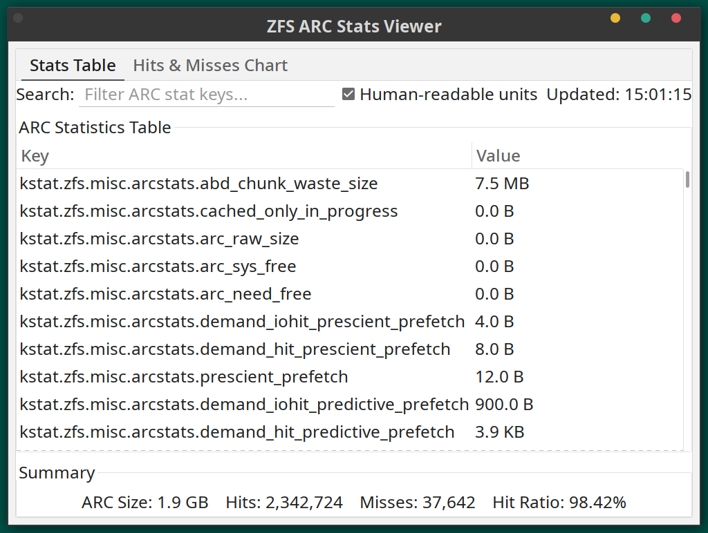
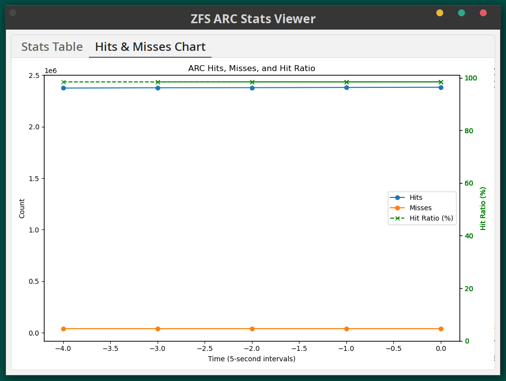

# ZFS ARC Stats Viewer


A GTK3 desktop application for monitoring ZFS ARC (Adaptive Replacement Cache) statistics in real-time on FreeBSD and its derivatives (e.g., GhostBSD). It provides a clean, graphical interface for viewing detailed ARC metrics and performance trends over time.

## Features

* **Real-time Monitoring:** Automatically fetches the latest stats every 5 seconds.
* **Tabbed Interface:**
    * **Stats Table:** A detailed, scrollable list of all `kstat.zfs.misc.arcstats` values.
    * **Hits & Misses Chart:** A historical graph plotting cache hits, misses, and hit ratio.
* **Search and Filter:** Instantly filter the stats table by key name.
* **Human-Readable Units:** Toggle between raw byte values and easy-to-read units (KB, MB, GB).
* **Performance Summary:** A clear summary of the most important metrics: ARC Size, Total Hits, Total Misses, and the current Hit Ratio.
* **In-App Help:** An "About" dialog provides version, license, and project information from within the application.
* **Visual Health Indicator:** The summary text turns orange if the hit ratio drops below 90%, providing an at-a-glance warning of potential performance issues.

## Screenshots

#### Stats Table View
*This view shows the detailed key-value statistics and the overall summary.*



#### Hits & Misses Chart
*This chart visualizes the cache hits, misses, and hit ratio over the last 5 minutes.*



## Requirements

#### 1. Operating System
* FreeBSD or a FreeBSD-derivative (e.g., GhostBSD) is required. The application relies on the `sysctl kstat.zfs.misc.arcstats` command, which is specific to these operating systems.

#### 2. System Dependencies
* You must have Python 3, GTK3, and the Python GObject introspection bindings installed. You can install them using the `pkg` package manager:
    ```sh
    sudo pkg install python311 gtk3 py311-pygobject
    ```

## Installation

1.  **Clone the repository:**
    ```sh
    git clone <your-repository-url>
    cd arcstats-viewer
    ```

2.  **(Optional) Create and activate a Python virtual environment:**
    ```sh
    python3 -m venv .venv
    source .venv/bin/activate
    ```

3.  **Install the application:**
    ```sh
    sudo python3 setup.py install
    ```

## Usage

Once installed, you can launch the application from your terminal by simply typing:

```
arcstats-viewer
```
